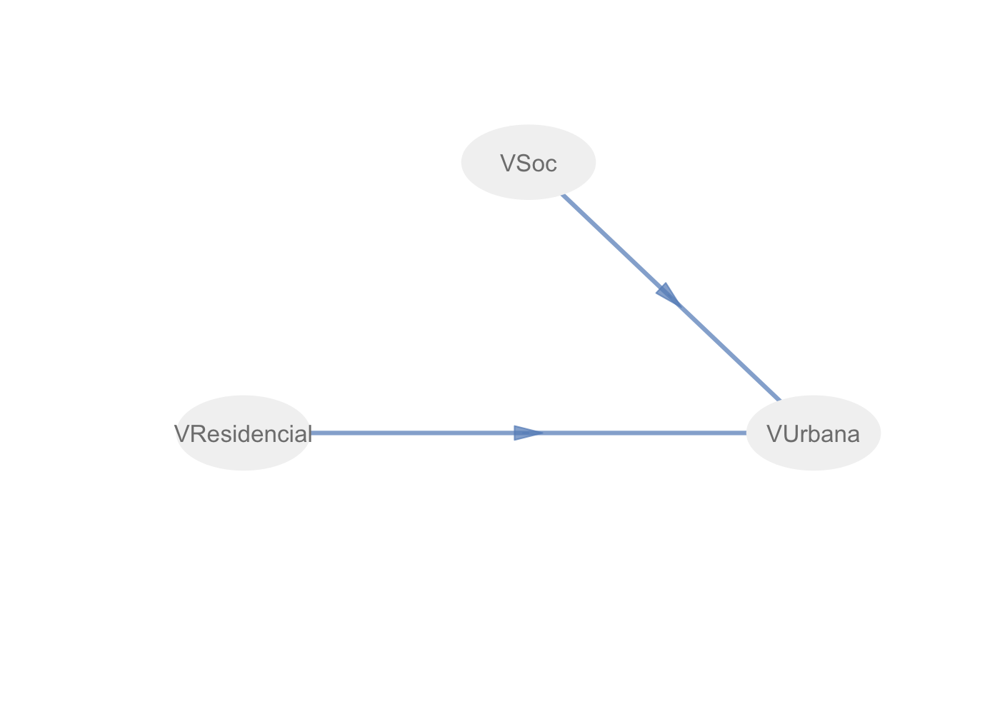
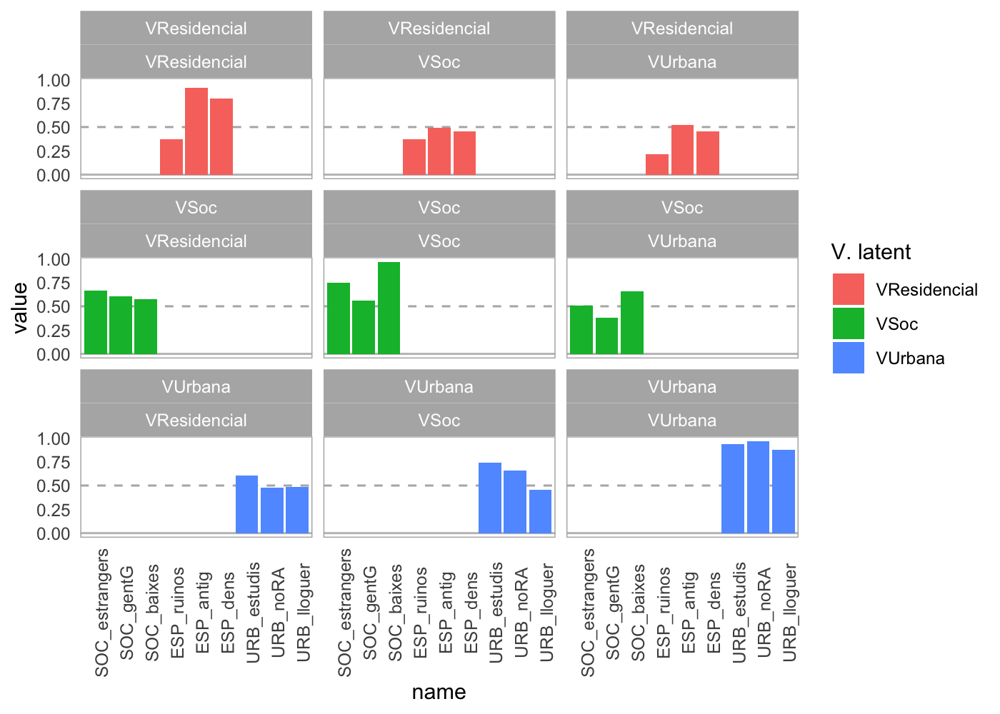
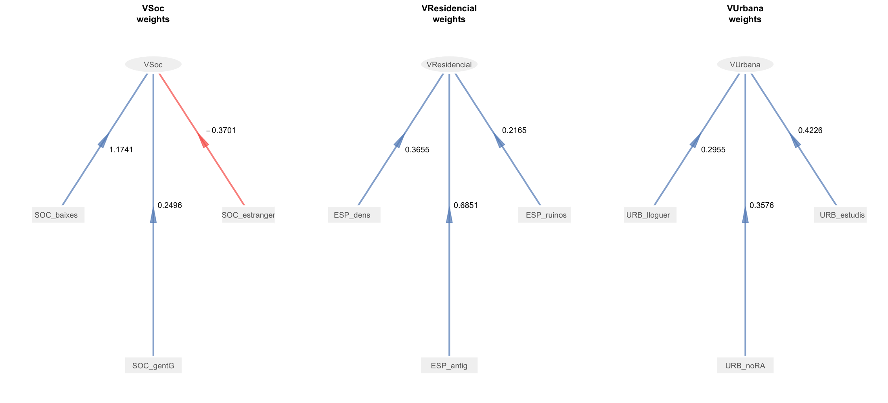
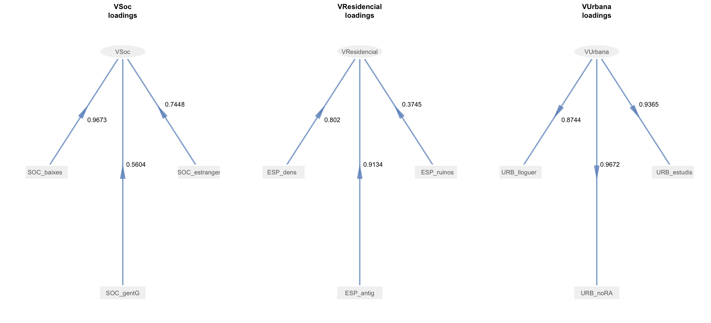
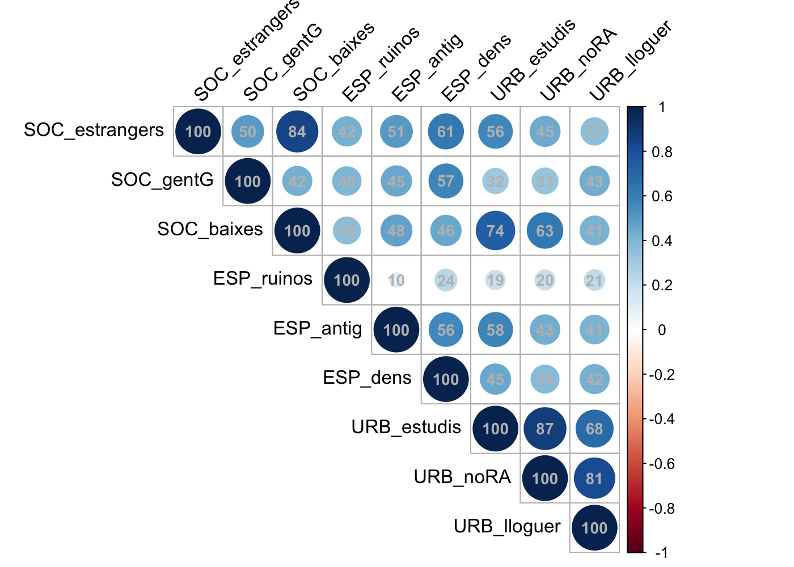
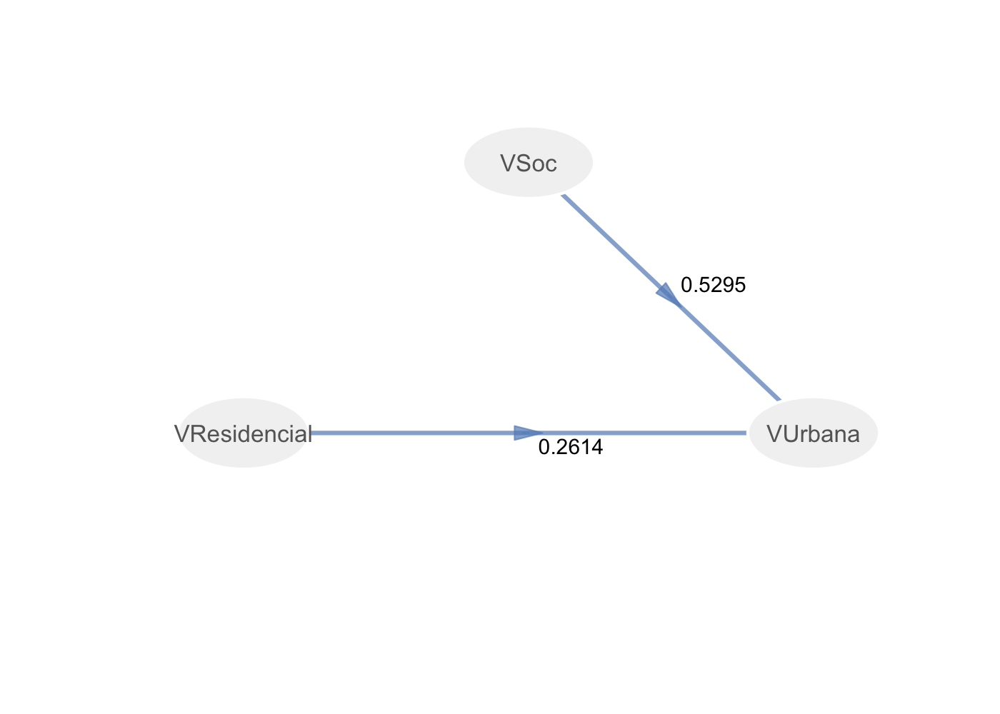
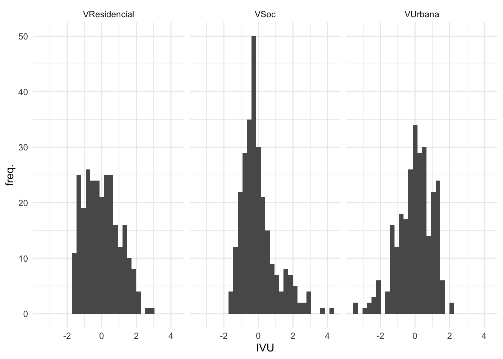
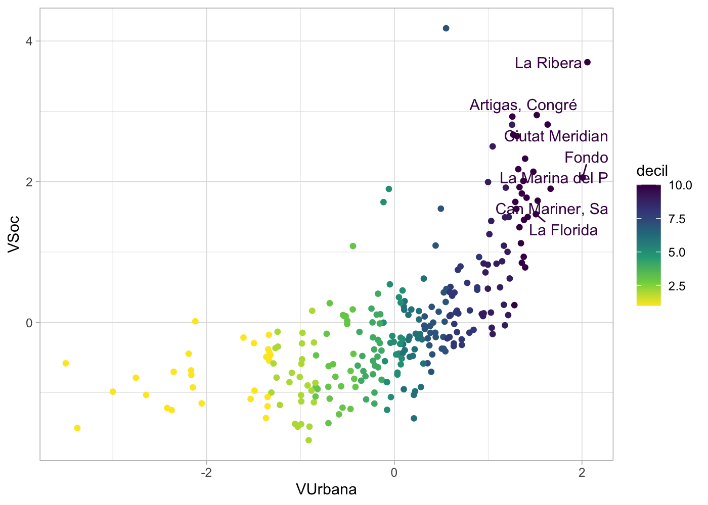
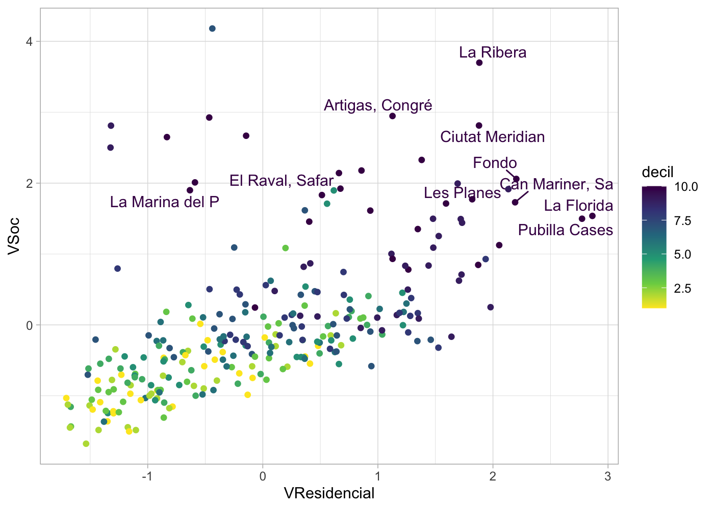
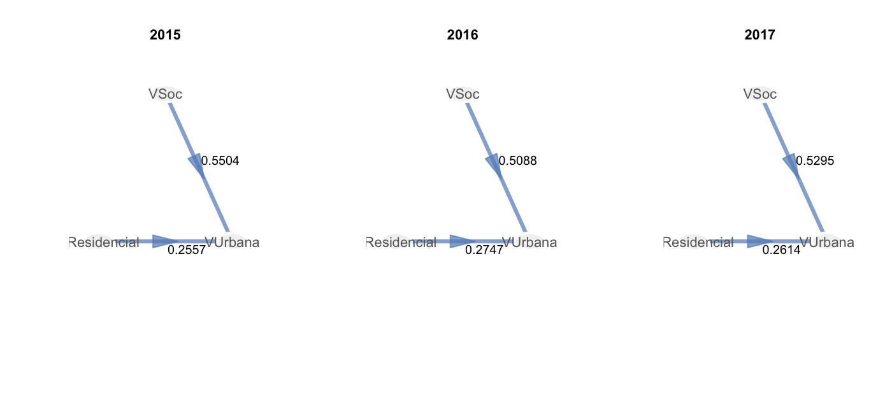

README: Metodologia seguida en el càlcul del IVU
================
11/05/2021

# Presentació i objectius

Aquest document exposa la metodologia seguida per l’elaboració de
l’Índex de Vulnerabilitat Urbana (en endavant IVU) proposat a
Antón-Alonso, Porcel, Cruz i Coll (2020).

S’ha compilat fent servir R 4.0.3 (R Core Team, 2020) i RStudio 1.4.1717
(2020). Les anàlisis pel model basat en *partial least squares path
modeling* (PLS-PM) s’han fet amb el paquet plspm (Sanchez, Trinchera &
Russolillo, 2017). L’organització de la presentació de resultats segueix
les recomanacions de Chin (2010).

El document s’estructura en les següents seccions. La primera secció és
la justificació metodològica del procediment, seguint el raonament
formulat a Antón-Alonso et al. (2020). La segona secció presenta el
model que es sotmet a contrast i el codi utilitat per executar-lo. La
tercera secció presenta els principals resultats. A continuació es
presenta una comparació dels resultats del model per diferents
anualitats. Finalment s’inclou la bibliografia i un annex amb l’output
complet de resultats.

# Justificació metodològica

El text d’aquesta secció prové d’Antón-Alonso et al. (2020).

> (…) a les tècniques d’anàlisi \[utilitzades en la construcció dels
> índex de vulnerabilitat urbana\] hi predominen les estratègies de
> reducció de dimensions (Coombes i Wong, 1994; Pratschke i Haase, 2007,
> 2015), entre les quals l’anàlisi de components principals (ACP) és la
> utilitzada amb una major freqüència. A banda de les seves virtuts, com
> la simplicitat i la interpretabilitat, l’ACP té certes limitacions que
> cal tenir presents (Haase i Pratschke, 2005). D’una banda, l’ACP, com
> l’anàlisi factorial (AF), tracta en conjunt totes les variables, sota
> la premissa que totes tenen relació amb les dimensions subjacents, de
> manera que no permet fer una anàlisi organitzada en dimensions.
> D’altra banda, tant l’ACP com l’AF són estratègies d’extracció de
> variància o covariància, els resultats de les quals són sensibles a
> les particularitats del conjunt de dades i de les variants de la
> tècnica que s’utilitza. Per exemple, en cas que existeixin valors
> atípics, o que s’apliqui algun tipus de rotació als factors, poden
> emergir diferents combinacions de relacions entre les variables i els
> factors. Això dificulta en gran manera la comparabilitat entre
> anualitats, pel fet que no es té certesa que la informació continguda
> en el primer factor de l’anàlisi d’una anualitat es correspongui amb
> la de l’anualitat següent. D’aquí les dificultats que presenta aquest
> mètode per a les anàlisis evolutives i per a la comparativa entre
> territoris. Per superar aquestes limitacions, s’han proposat models
> d’equacions estructurals (Haase i Pratschke, 2005). Aquest mètode
> permet configurar una estructura factorial molt més estable a partir
> del control de les diverses dimensions que agrupen els indicadors que
> intervenen en l’anàlisi (Miles et al., 2016; Pratschke i Haase, 2007,
> 2015), i d’estratègies d’anàlisi per comparar l’estabilitat del model
> al llarg del temps. (…)

> **L’Índex de Vulnerabilitat Urbana (IVU): una proposta per a l’àrea
> metropolitana de Barcelona**

> La proposta d’índex de vulnerabilitat urbana que es presenta en aquest
> article tracta d’atendre les debilitats i mancances metodològiques
> esmentades anteriorment. Es tracta d’una revisió de l’anterior índex
> de vulnerabilitat urbana que ja havien elaborat Antón-Alonso i Porcel
> (2018) per a l’àrea metropolitana de Barcelona a partir d’una ACP i de
> dades censals. El nou Índex de Vulnerabilitat Urbana (IVU) incorpora
> alguns canvis en els indicadors utilitzats i es construeix a través
> d’un model d’equacions estructurals basat en mínims quadrats
> parcials (PLS-SEM), una tècnica d’anàlisi estadística que integra
> estratègies de reducció de dimensions amb l’anàlisi de regressió.
> Aquest mètode permet resoldre les limitacions en l’anàlisi evolutiva
> que s’han explicat anteriorment. A més, per a l’operacionalització del
> model es fan servir majoritàriament dades procedents de registres
> administratius, la qual cosa possibilita que l’índex es pugui calcular
> amb una periodicitat anual.

> \[*PLS-SEM en l’estudi de la vulnerabilitat urbana*\]

> El PLS-SEM permet estudiar les relacions causals complexes entre
> variables manifestes o observades i dimensions latents. El procediment
> permet quantificar la contribució de cada variable manifesta a la seva
> dimensió latent i modelitzar la relació entre les dimensions latents.
> A diferència del vessant dels models d’equacions estructurals basats
> en les covariàncies \[utilitzats per altres autors per l’estudi de la
> vulnerabilitat urbana (com Pratschke i Haase, 2007, 2014)\], la
> tècnica de PLS-SEM permet definir no tan sols models reflectius, sinó
> també models formatius, que són més adients per al tipus d’objecte
> d’anàlisi que aquí s’ha plantejat \[donat el tipus de relació que
> els indicadors mantenen entre ells, així com amb els constructes
> latents\] (Sanchez, 2013).

> Amb l’aplicació d’aquesta tècnica d’anàlisi a l’IVU s’assoleixen
> diversos objectius. En primer lloc, entendre la vulnerabilitat urbana
> com un fenomen complex, en què intervenen diverses dimensions de
> vulnerabilitat. En segon lloc, l’anàlisi proveeix d’una variable
> contínua amb les puntuacions del factor latent resultant, fet que
> possibilita treballar amb la idea de contínuum a partir de la qual es
> concep la vulnerabilitat a l’espai urbà. Finalment, s’aconsegueix
> obtenir uns resultats comparables al llarg de diverses edicions, la
> qual cosa permet fer una anàlisi evolutiva més robusta.

> La construcció del model ha estat guiada per tres principis: a)
> respectar al màxim els elements teòrics; b) aconseguir un resultat tan
> parsimoniós com sigui possible; i c) que aquest sigui fàcilment
> interpretable.

> La definició del model es basa en les aportacions teòriques d’Alguacil
> et al. (2014), segons les quals la vulnerabilitat urbana és el
> resultat de la combinació i retroalimentació de processos d’exclusió
> social i residencial produïts en el territori. Així, es proposen dues
> dimensions, una de risc social i una altra de risc residencial, amb
> tres indicadors cadascuna. La seva confluència en el territori acaba
> definint la vulnerabilitat urbana. A més, també s’introdueixen en el
> model alguns dels efectes que es deriven de la vulnerabilitat urbana,
> com ara les afectacions en el mercat de l’habitatge (preus del
> lloguer), el poc atractiu residencial que presenten aquestes àrees per
> a la població de classe mitjana i els anomenats efectes de barri,
> operacionalitzat a partir dels nivells de formació assolits pels
> residents.

> \[*Fonts de dades i unitats territorials*\]

> La informació a partir de la qual es treballa procedeix de diverses
> fonts de dades, la majoria de les quals alimentades a partir de
> registres administratius: Atles de distribució de renda de les llars,
> Padró municipal d’habitants, Cadastre, Sistema estatal d’Índex de
> Preus de Lloguer d’Habitatge i Cens de població i habitatges. La taula
> 1 mostra l’operacionalització i les fonts d’informació emprades per a
> la construcció de l’IVU.

> Taula 1: Dimensions, conceptes, indicadors i fonts de l’IVU

> Les unitats territorials sobre les quals es calcula l’IVU són els
> anomenats Àmbits Estadístics Metropolitans (AEM) \[veure Mapa 1\],
> unes unitats que s’aproximen al concepte de barri. La delimitació
> d’aquests àmbits ha estat elaborada recentment per l’Àrea de
> Planificació Estratègica de l’Àrea Metropolitana de Barcelona, basada
> en una demarcació prèvia de barris metropolitans realitzada per
> l’IERMB (Antón-Alonso, Cónsola, Donat, Porcel i Coll, 2016). Els AEM
> constitueixen actualment les unitats territorials inframunicipals de
> referència a l’àrea metropolitana de Barcelona i estan conformats per
> 268 unitats que compten amb un mínim de 291 habitants i un màxim de
> 58.180, essent 12.117 la mitjana de població. La no disponibilitat de
> dades directes que informin d’aquestes unitats territorials ha obligat
> a fer servir un mètode d’estimació que es basa en la redistribució de
> la informació procedent de seccions censals o parcel·les residencials
> (en el cas de la informació provinent del Cadastre), per a les quals
> sí que es disposa d’informació. Es tracta d’una estimació inspirada
> en el Cadastral-based Expert Dasymetric System, un dels mètodes areals
> d’interpolació que ja ha estat emprat en altres estudis (Maantay et
> al., 2007; Mora-García i Marti-Ciriquian, 2015).3

> Mapa 1: Àmbits Estadístics Metropolitans

# Model sota contrast

# Resultats de validació del model

El model proposat es representa gràficament a la Figura 1, i es pot
llegir de la següent manera: *A major vulnerabilitat social i major
vulnerabilitat residencial, major vulnerabilitat urbana*. Es comença
realitzant l’anàlisi sobre les dades d’una anualitat (2017).

**Figura 2: Inner model**   

A continuació es presenten els principals resultats pel contrast del
model.

    ## Partial Least Squares Path Modeling (PLS-PM) 
    ## ---------------------------------------------
    ##    NAME             DESCRIPTION
    ## 1  $outer_model     outer model
    ## 2  $inner_model     inner model
    ## 3  $path_coefs      path coefficients matrix
    ## 4  $scores          latent variable scores
    ## 5  $crossloadings   cross-loadings
    ## 6  $inner_summary   summary inner model
    ## 7  $effects         total effects
    ## 8  $unidim          unidimensionality
    ## 9  $gof             goodness-of-fit
    ## 10 $boot            bootstrap results
    ## 11 $data            data matrix
    ## ---------------------------------------------
    ## You can also use the function 'summary'

## Measurement model results

Donat que el model plantejat és formatiu, la manera d’avaluar el
measurement model es basarà en les següents mesures:

  - La unidimensionalitat dels constructes (a partir del valor de les
    eigenvalues)
  - Els pesos (weights) i càrregues (loadings) dels indicadors, per
    veure les seves contribucions sobre els constructes latents
  - La multicolinealitat entre els indicadors

Els blocs es poden considerar unidimensionals, ja que en tots tres
casos, la primera eigenvalue és superior a 1 i la segona és inferior a
1. La dimensió residencial seria la que presenta les menors distàncies
entre les eigenvalues i el llindar de referència (1), però en tot cas
els constructes es poden considerar conceptualment diferents. Aquesta
puntuació més baixa estaria relacionada amb el fet que la proporció
d’habitatge en estat ruïnós té un valor molt similar en els
crossloadings de les dimensions Social i Residencial. De manera similar,
la proporció de població major de 75 anys té un loading molt proper però
major a la dimensió Residencial que no a la Social a la qual pertany. La
Figura 2 sintetitza els valors de crossloading.

**Figura 2: Crossloadings**

**Figura 2: Outer model weights**
<!-- -->

**Figura 2: Outer model loadings**
<!-- -->

Un dels indicadors (població estrangera) té un pes negatiu, però els
loadings són positius (es descarta una codificació inversa). S’observa
una elevada correlació amb la proporció de població amb rendes baixes,
tot i que la correlació entre les dues és inferior al 90% i el VIF
d’aquesta variable és inferior a 5. Per tot plegat, es considerarà
aquest resultat com a no problemàtic. La interpretació seria que la
proporció de població estrangera té una relació negativa amb el
constructe de la vulnerabilitat social, després de controlar per la
proporció de població amb rendes baixes i de gent gran.

**Figura 3: correlacions entre variables manifestes (%)**

**Taula 1: VIF pels indicadors de la dimensió social**

    ## d17$SOC_estrangers      d17$SOC_gentG     d17$SOC_baixes 
    ##           3.792748           1.331959           3.464562

## Structural model

**Figura 4: Inner model**   

**Taula 2: Coeficients de regressió per l’Inner model**

|              |  Estimate | Std..Error |   t.value |  Pr…t.. |
| :----------- | --------: | ---------: | --------: | ------: |
| Intercept    | 0.0000000 |  0.0430255 |  0.000000 | 1.0e+00 |
| VSoc         | 0.5295425 |  0.0528414 | 10.021365 | 0.0e+00 |
| VResidencial | 0.2613748 |  0.0528414 |  4.946405 | 1.3e-06 |

**Taula 3: Coeficients de determinació de les variables latents
endògenes**

|              | Type       |        R2 | Block\_Communality | Mean\_Redundancy |       AVE |
| :----------- | :--------- | --------: | -----------------: | ---------------: | --------: |
| VSoc         | Exogenous  | 0.0000000 |          0.6015036 |        0.0000000 | 0.0000000 |
| VResidencial | Exogenous  | 0.0000000 |          0.5392325 |        0.0000000 | 0.0000000 |
| VUrbana      | Endogenous | 0.5094329 |          0.8590119 |        0.4376089 | 0.8590119 |

El valor de la R^2 i de la redundància es poden considerar com a
moderats (l’habilitat dels constructes latents per predir el constructe
endògen és moderada).

**Goodnes of Fit**

    ## [1] 0.5827342

### Validació del model via Bootstrapping

A continuació es presenten els resultats del bootstrapping, que és una
estratègia no paramètrica per estimar la precisió dels paràmetres del
PLS.

A cadascuna de les taules a continuació, veiem que les mitjanes
obtingudes per bootstrapping no guarden grans distàncies amb els valors
originals del model, i que els intervals de confiança del 95% no
contenen el 0.

**Taula 4: Bootstrapping weights**

|                          |    Original |   Mean.Boot | Std.Error |    perc.025 |    perc.975 |
| :----------------------- | ----------: | ----------: | --------: | ----------: | ----------: |
| VSoc-SOC\_estrangers     | \-0.3700730 | \-0.3789777 | 0.1523641 | \-0.6927857 | \-0.0740331 |
| VSoc-SOC\_gentG          |   0.2496385 |   0.2494116 | 0.0812407 |   0.0895516 |   0.4244484 |
| VSoc-SOC\_baixes         |   1.1741024 |   1.1748053 | 0.1275444 |   0.9473852 |   1.4524029 |
| VResidencial-ESP\_ruinos |   0.2165441 |   0.2172330 | 0.0935971 |   0.0475954 |   0.4015663 |
| VResidencial-ESP\_antig  |   0.6851378 |   0.6850159 | 0.0888132 |   0.4846515 |   0.8521077 |
| VResidencial-ESP\_dens   |   0.3654748 |   0.3576008 | 0.1027094 |   0.1490401 |   0.5588242 |
| VUrbana-URB\_estudis     |   0.4225793 |   0.4211800 | 0.0122495 |   0.3986459 |   0.4456801 |
| VUrbana-URB\_noRA        |   0.3576481 |   0.3564778 | 0.0089577 |   0.3399635 |   0.3737895 |
| VUrbana-URB\_lloguer     |   0.2954607 |   0.2972304 | 0.0131848 |   0.2724282 |   0.3218851 |

**Taula 5: Bootstrapping loadings**

|                          |    Original |   Mean.Boot | Std.Error |    perc.025 |    perc.975 |
| :----------------------- | ----------: | ----------: | --------: | ----------: | ----------: |
| VSoc-SOC\_estrangers     | \-0.3700730 | \-0.3789777 | 0.1523641 | \-0.6927857 | \-0.0740331 |
| VSoc-SOC\_gentG          |   0.2496385 |   0.2494116 | 0.0812407 |   0.0895516 |   0.4244484 |
| VSoc-SOC\_baixes         |   1.1741024 |   1.1748053 | 0.1275444 |   0.9473852 |   1.4524029 |
| VResidencial-ESP\_ruinos |   0.2165441 |   0.2172330 | 0.0935971 |   0.0475954 |   0.4015663 |
| VResidencial-ESP\_antig  |   0.6851378 |   0.6850159 | 0.0888132 |   0.4846515 |   0.8521077 |
| VResidencial-ESP\_dens   |   0.3654748 |   0.3576008 | 0.1027094 |   0.1490401 |   0.5588242 |
| VUrbana-URB\_estudis     |   0.4225793 |   0.4211800 | 0.0122495 |   0.3986459 |   0.4456801 |
| VUrbana-URB\_noRA        |   0.3576481 |   0.3564778 | 0.0089577 |   0.3399635 |   0.3737895 |
| VUrbana-URB\_lloguer     |   0.2954607 |   0.2972304 | 0.0131848 |   0.2724282 |   0.3218851 |

**Taula 6: Bootstrapping paths**

|                          |  Original | Mean.Boot | Std.Error |  perc.025 | perc.975 |
| :----------------------- | --------: | --------: | --------: | --------: | -------: |
| VSoc -\> VUrbana         | 0.5295425 | 0.5341134 | 0.0398461 | 0.4519148 | 0.605395 |
| VResidencial -\> VUrbana | 0.2613748 | 0.2632162 | 0.0426326 | 0.1825884 | 0.348350 |

**Taula 7: Bootstrapping R^2**

|         |  Original | Mean.Boot | Std.Error | perc.025 | perc.975 |
| :------ | --------: | --------: | --------: | -------: | -------: |
| VUrbana | 0.5094329 | 0.5200809 |  0.032425 | 0.460778 | 0.579563 |

**Taula 8: Bootstrapping total effects**

|                          |  Original | Mean.Boot | Std.Error |  perc.025 | perc.975 |
| :----------------------- | --------: | --------: | --------: | --------: | -------: |
| VSoc -\> VResidencial    | 0.0000000 | 0.0000000 | 0.0000000 | 0.0000000 | 0.000000 |
| VSoc -\> VUrbana         | 0.5295425 | 0.5341134 | 0.0398461 | 0.4519148 | 0.605395 |
| VResidencial -\> VUrbana | 0.2613748 | 0.2632162 | 0.0426326 | 0.1825884 | 0.348350 |

## Anàlisi de les variables latents

La Figura 5 presenta la distribució de les puntuacions obtingudes pels
constructes latents a partir del model.

**Figura 5: Puntuacions de les variables latents**

L’índex de vulnerabilitat urbana té una distribució amb una asimetria
negativa, fent més llarga la cua inferior, el que es pot entendre com un
petit nombre de barris amb un IVU molt baix, que formarien els barris
*menys* vulnerables. Això vol dir que a l’extrem oposat hi ha els barris
més vulnerables, que no formen una cua sinó un bloc. Aquesta mena de
bloc a l’extrem superior s’observa a les tres variables latents.

**Barris a l’extrem superior de cada variable latent**

| Vulnerabilitat\_Social               | Vulnerabilitat\_Residencial | Vulnerabilitat\_Urbana               |
| :----------------------------------- | :-------------------------- | :----------------------------------- |
| Artigas, Congrés, El Remei, Sant Roc | Sant Ildefons               | Artigas, Congrés, El Remei, Sant Roc |
| Torre Baró                           | La Torrassa                 | La Marina del Prat Vermell           |
| Ciutat Meridiana                     | La Florida                  | Ciutat Meridiana                     |
| La Ribera                            | Pubilla Cases               | La Florida                           |
| Sant Cosme                           | Les Planes                  | La Ribera                            |
| La Mina                              | Can Mariner, Santa Rosa     | Can Mariner, Santa Rosa              |
| La Verneda                           | Fondo                       | Fondo                                |

**Figura 6: Distribució dels barris segons les puntuacions en el
constructe de Vulnerabilitat Urbana i de Vulnerabilitat Social**

**Figura 7: Distribució dels barris segons les puntuacions en el
constructe de Vulnerabilitat Residencial i de Vulnerabilitat Social**

# Resultats d’anàlisi del model

A continuació es presenten un conjunt de mapes on es cartografien els
resultats de l’IVU.

**Mapa 2: Dimensió de la vulnerabilitat residencial. AMB, 2017**

**Mapa 3: Dimensió de la vulnerabilitat social. AMB, 2017**

**Mapa 4: Índex de vulnerabilitat urbana (IVU). AMB, 2017**

# Comparació del model per anualitats

El model exposat fins el moment, realitzat amb dades de 2017, s’aplica a
les dades de 2015 i 2016. A continuació es presenten les anàlisis que
permeten concloure que el IVU de les diferents edicions és comparable.

S’aplica un Two-sample T-test per parells sobre la hipòtesi nul·la que
els dos grups (edicions) són equivalents. L’evidència disponible no
permet rebutjar la H0, per tant podem considerar que els coeficients
dels dos anys són equivalents, o en altres paraules, l’índex és
comparable entre anualitats.

**Figura 8: models IVU 2015 : 2017**
<!-- -->

No hi ha diferències entre 2015 i 2016, és a dir, els models es
comporten de manera equivalent i per tant són comparables.

    ## GROUP COMPARISON IN PLS-PM FOR PATH COEFFICIENTS 
    ## 
    ## Scale of Data:       TRUE 
    ## Weighting Scheme:    centroid 
    ## Selected method:     bootstrap 
    ## Num of replicates:   100 
    ## 
    ## $test 
    ##                        global  group.2015  group.2016  diff.abs  t.stat  deg.fr
    ## VSoc->VUrbana          0.5315      0.5504      0.5088    0.0416  0.5230     534
    ## VResidencial->VUrbana  0.2640      0.2557      0.2747    0.0190  0.2838     534
    ##                        p.value  sig.05
    ## VSoc->VUrbana           0.3006      no
    ## VResidencial->VUrbana   0.3883      no
    ## 
    ## Inner models in the following objects: 
    ## $global  
    ## $group1  
    ## $group2

Tampoc hi ha diferències entre 2015 i 2017, pel que també podem dir que
els models són comparables.

    ## GROUP COMPARISON IN PLS-PM FOR PATH COEFFICIENTS 
    ## 
    ## Scale of Data:       TRUE 
    ## Weighting Scheme:    centroid 
    ## Selected method:     bootstrap 
    ## Num of replicates:   100 
    ## 
    ## $test 
    ##                        global  group.2015  group.2017  diff.abs  t.stat  deg.fr
    ## VSoc->VUrbana          0.5424      0.5504      0.5295    0.0209  0.4044     534
    ## VResidencial->VUrbana  0.2574      0.2557      0.2614    0.0057  0.0733     534
    ##                        p.value  sig.05
    ## VSoc->VUrbana           0.3430      no
    ## VResidencial->VUrbana   0.4708      no
    ## 
    ## Inner models in the following objects: 
    ## $global  
    ## $group1  
    ## $group2

# Bibliografia

Antón-Alonso, F., Porcel, S., Cruz, I., Coll, F. (2020). *La
vulenerabilitat urbana a Barcelona: persistència, concentració i
complexitat.* Papers. Regió Metropolitana de Barcelona, 63, pp. 50-67.

Chin, W. (2010). *How to Write Up and Report PLS Analyses*, a Esposito
Vinzi, V., Chin, W.W., Henseler, J., Wang, H. (Eds.). Berlin: Springer.

R Core Team (2020). R: A language and environment for statistical
computing. R Foundation for Statistical Computing, Vienna, Austria. URL
<https://www.R-project.org/>.

RStudio Team (2020). RStudio: Integrated Development for R. RStudio,
PBC, Boston, MA URL <http://www.rstudio.com/>.

Sanchez,G., Trinchera, L. i Russolillo, G. (2017). plspm: Tools for
Partial Least Squares Path Modeling (PLS-PM). R package version 0.4.9.
<https://CRAN.R-project.org/package=plspm>.

# Annex

## Resultats complets del model (2017)

    ## PARTIAL LEAST SQUARES PATH MODELING (PLS-PM) 
    ## 
    ## ---------------------------------------------------------- 
    ## MODEL SPECIFICATION 
    ## 1   Number of Cases      268 
    ## 2   Latent Variables     3 
    ## 3   Manifest Variables   9 
    ## 4   Scale of Data        Standardized Data 
    ## 5   Non-Metric PLS       FALSE 
    ## 6   Weighting Scheme     centroid 
    ## 7   Tolerance Crit       1e-06 
    ## 8   Max Num Iters        100 
    ## 9   Convergence Iters    5 
    ## 10  Bootstrapping        TRUE 
    ## 11  Bootstrap samples    300 
    ## 
    ## ---------------------------------------------------------- 
    ## BLOCKS DEFINITION 
    ##            Block         Type   Size   Mode
    ## 1           VSoc    Exogenous      3      B
    ## 2   VResidencial    Exogenous      3      B
    ## 3        VUrbana   Endogenous      3      A
    ## 
    ## ---------------------------------------------------------- 
    ## BLOCKS UNIDIMENSIONALITY 
    ##               Mode  MVs  C.alpha  DG.rho  eig.1st  eig.2nd
    ## VSoc             B    3    0.000   0.000     2.20    0.650
    ## VResidencial     B    3    0.000   0.000     1.65    0.926
    ## VUrbana          A    3    0.918   0.949     2.58    0.323
    ## 
    ## ---------------------------------------------------------- 
    ## OUTER MODEL 
    ##                     weight  loading  communality  redundancy
    ## VSoc                                                        
    ##   1 SOC_estrangers  -0.370    0.745        0.555       0.000
    ##   1 SOC_gentG        0.250    0.560        0.314       0.000
    ##   1 SOC_baixes       1.174    0.967        0.936       0.000
    ## VResidencial                                                
    ##   2 ESP_ruinos       0.217    0.375        0.140       0.000
    ##   2 ESP_antig        0.685    0.913        0.834       0.000
    ##   2 ESP_dens         0.365    0.802        0.643       0.000
    ## VUrbana                                                     
    ##   3 URB_estudis      0.423    0.936        0.877       0.447
    ##   3 URB_noRA         0.358    0.967        0.935       0.477
    ##   3 URB_lloguer      0.295    0.874        0.765       0.390
    ## 
    ## ---------------------------------------------------------- 
    ## CROSSLOADINGS 
    ##                      VSoc  VResidencial  VUrbana
    ## VSoc                                            
    ##   1 SOC_estrangers  0.745         0.662    0.507
    ##   1 SOC_gentG       0.560         0.608    0.382
    ##   1 SOC_baixes      0.967         0.574    0.659
    ## VResidencial                                    
    ##   2 ESP_ruinos      0.369         0.375    0.213
    ##   2 ESP_antig       0.488         0.913    0.520
    ##   2 ESP_dens        0.454         0.802    0.456
    ## VUrbana                                         
    ##   3 URB_estudis     0.739         0.603    0.936
    ##   3 URB_noRA        0.655         0.480    0.967
    ##   3 URB_lloguer     0.456         0.482    0.874
    ## 
    ## ---------------------------------------------------------- 
    ## INNER MODEL 
    ## $VUrbana
    ##                 Estimate   Std. Error     t value   Pr(>|t|)
    ## Intercept      -1.29e-17       0.0430   -3.01e-16   1.00e+00
    ## VSoc            5.30e-01       0.0528    1.00e+01   2.99e-20
    ## VResidencial    2.61e-01       0.0528    4.95e+00   1.34e-06
    ## 
    ## ---------------------------------------------------------- 
    ## CORRELATIONS BETWEEN LVs 
    ##                VSoc  VResidencial  VUrbana
    ## VSoc          1.000         0.581    0.681
    ## VResidencial  0.581         1.000    0.569
    ## VUrbana       0.681         0.569    1.000
    ## 
    ## ---------------------------------------------------------- 
    ## SUMMARY INNER MODEL 
    ##                     Type     R2  Block_Communality  Mean_Redundancy    AVE
    ## VSoc           Exogenous  0.000              0.602            0.000  0.000
    ## VResidencial   Exogenous  0.000              0.539            0.000  0.000
    ## VUrbana       Endogenous  0.509              0.859            0.438  0.859
    ## 
    ## ---------------------------------------------------------- 
    ## GOODNESS-OF-FIT 
    ## [1]  0.5827
    ## 
    ## ---------------------------------------------------------- 
    ## TOTAL EFFECTS 
    ##              relationships  direct  indirect  total
    ## 1     VSoc -> VResidencial   0.000         0  0.000
    ## 2          VSoc -> VUrbana   0.530         0  0.530
    ## 3  VResidencial -> VUrbana   0.261         0  0.261
    ## 
    ## --------------------------------------------------------- 
    ## BOOTSTRAP VALIDATION 
    ## weights 
    ##                          Original  Mean.Boot  Std.Error  perc.025  perc.975
    ## VSoc-SOC_estrangers        -0.370     -0.379    0.15236   -0.6928    -0.074
    ## VSoc-SOC_gentG              0.250      0.249    0.08124    0.0896     0.424
    ## VSoc-SOC_baixes             1.174      1.175    0.12754    0.9474     1.452
    ## VResidencial-ESP_ruinos     0.217      0.217    0.09360    0.0476     0.402
    ## VResidencial-ESP_antig      0.685      0.685    0.08881    0.4847     0.852
    ## VResidencial-ESP_dens       0.365      0.358    0.10271    0.1490     0.559
    ## VUrbana-URB_estudis         0.423      0.421    0.01225    0.3986     0.446
    ## VUrbana-URB_noRA            0.358      0.356    0.00896    0.3400     0.374
    ## VUrbana-URB_lloguer         0.295      0.297    0.01318    0.2724     0.322
    ## 
    ## loadings 
    ##                          Original  Mean.Boot  Std.Error  perc.025  perc.975
    ## VSoc-SOC_estrangers         0.745      0.736    0.06521     0.606     0.849
    ## VSoc-SOC_gentG              0.560      0.562    0.07199     0.419     0.702
    ## VSoc-SOC_baixes             0.967      0.960    0.02102     0.909     0.989
    ## VResidencial-ESP_ruinos     0.375      0.374    0.09018     0.198     0.553
    ## VResidencial-ESP_antig      0.913      0.908    0.03674     0.825     0.963
    ## VResidencial-ESP_dens       0.802      0.791    0.05949     0.662     0.898
    ## VUrbana-URB_estudis         0.936      0.937    0.00547     0.925     0.947
    ## VUrbana-URB_noRA            0.967      0.967    0.00459     0.957     0.975
    ## VUrbana-URB_lloguer         0.874      0.876    0.01720     0.839     0.905
    ## 
    ## paths 
    ##                          Original  Mean.Boot  Std.Error  perc.025  perc.975
    ## VSoc -> VUrbana             0.530      0.534     0.0398     0.452     0.605
    ## VResidencial -> VUrbana     0.261      0.263     0.0426     0.183     0.348
    ## 
    ## rsq 
    ##          Original  Mean.Boot  Std.Error  perc.025  perc.975
    ## VUrbana     0.509       0.52     0.0324     0.461      0.58
    ## 
    ## total.efs 
    ##                          Original  Mean.Boot  Std.Error  perc.025  perc.975
    ## VSoc -> VResidencial        0.000      0.000     0.0000     0.000     0.000
    ## VSoc -> VUrbana             0.530      0.534     0.0398     0.452     0.605
    ## VResidencial -> VUrbana     0.261      0.263     0.0426     0.183     0.348
